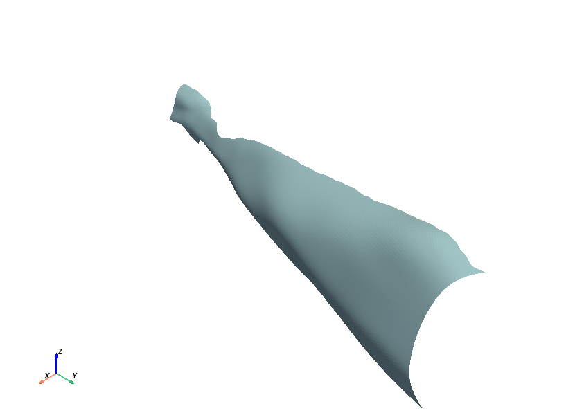

====================
Geodesic-Path-Finder
====================
.. image:: ../images/App_Icons/sheen_robotic_hand.png
    :align: left
    :width: 200

Uses UV mapping of the right and left upper arms of male and female presenting 3D models to find the distances between drawn sensory locations from 2D hand and arm
images on the 3D arm images. This is done using the `Heat Method <https://dl.acm.org/doi/abs/10.1145/2516971.2516977>`__ to find the distance from any given point to
any other point on the mesh. Given a starting sensory location, a distance array to every other vertex is found by using the Heat Method along the triangulated arm
mesh. The end vertex number is then used as the index of the distance array to extract out the geodesic distance between the input points.
A visualization of the path between the points is also found using `edge flips <https://dl.acm.org/doi/abs/10.1145/3414685.3417839>`__. The mesh can be visualized
using `Polyscope <https://polyscope.run/py/>`__ in python.

To convert from the 2D image of location drawings to the 3D x, y, z position, the mesh is [UV mapped](#uv-mapping) to the location drawing so that x and y pxiel
values on the drawing correspoind to x, y, z vertex values on the 3D mesh.

.. note::
    The edge flip method of showing a path does not guarentee the shortest path along the mesh, it is just a short path.
    The Heat Method distance should be used for any distance metric.

.. |github| image:: https://img.shields.io/github/followers/Nabizzle?style=social
    :target: https://github.com/Nabizzle
.. |python| image:: https://img.shields.io/badge/python-v3.9-blue
.. |docs| image:: https://readthedocs.org/projects/geodesic-path-finder-documentation/badge/?version=latest
    :target: https://geodesic-path-finder-documentation.readthedocs.io/en/latest/?badge=latest

|github| |python| |docs|

===============
App Description
===============
The app allow the user to find geodesic distance and path information in multiple ways.

The top row allows the user to select between male and female right and left arms. These correspond to the right and left location drawing images. The load mesh
button must be pressed to load in the mesh data. For speed to loading, the mesh data has been presaved as compressed .npz files in the Data folder. Refer to the
`Save Mesh Data notebook <https://github.com/Nabizzle/Geodesic-Path-Finder/blob/main/Code/Save%20Mesh%20Data.ipynb>`__ for how the mesh data is extracted and saved.

.. note::
    The original location drawings are modeled after a male body so the fit to the female form may not be perfect. Refer to the `UV Mapping`_
    section for how the meshes were mapped to the location drawings.

The next two rows of the app allow the user to input in pixel values to two locations to measure between. The pixel values start from the top left corner and must
match up with the dimensions of the `right <https://github.com/Nabizzle/Geodesic-Path-Finder-Documentation/blob/main/Media/right%20arm.png>`__ and
`left <https://github.com/Nabizzle/Geodesic-Path-Finder-Documentation/blob/main/Media/left%20arm.png>`__ location drawings in the Media folder.

The fourth row of the app offers two additional ways of inputting starting and ending location information. The first two buttons in the row allow the user to click
on the location drawings to manually set start and end locations. An example of the right location image is below:

The final button of this row allow the user to load a table of starting and ending pixel values from a csv. The csv must start with headers for the start and end x
and y values. Any row with a missing value in the table is ommitted. An example table of values is below.

+---------+---------+-------+-------+
| start x | start y | end x | end y |
+=========+=========+=======+=======+
|   126   |   75    |  83   |  116  |
+---------+---------+-------+-------+
|   236   |   508   |  103  |  614  |
+---------+---------+-------+-------+
|   278   |   231   |  197  |  800  |
+---------+---------+-------+-------+
|   227   |   76    |  71   |  30   |
+---------+---------+-------+-------+
|   276   |   91    |  84   |  896  |
+---------+---------+-------+-------+

The final row of the app allow the user to caluculate the geodesic distances from the starting point(s) to the end point(s) and the paths between the points. These
calculations are output as .mat files to the output folder in the Data folder and added to the mesh visualization brought up by the third button in the row.
This button can be clicked at any time to see what has been added to polyscope. An example of a finished visualization with both the distance and path between
verticies is shown here.

A breakdown of how the app works behind the scenes is also in the
`UV to 3D Path notebook <https://github.com/Nabizzle/Geodesic-Path-Finder/blob/main/Code/UV%20to%203D%20Path.ipynb>`__. A more simple example on the male right arm
mesh is in the `Right Hand Path Test notebook <https://github.com/Nabizzle/Geodesic-Path-Finder/blob/main/Code/Right%20Hand%20Path%20Test.ipynb>`__ and a simple
example on a sphere is in the
`Simple Geodesic Path Test notebook <https://github.com/Nabizzle/Geodesic-Path-Finder/blob/main/Code/Simple%20Geodesic%20Path%20Test.ipynb>`__.

==================================
Streamlined Geodesic Finding Class
==================================
There is a second method implimented for finding geodeisc distances and paths outside of the app. It uses the geodesic_path.py code and impliments a class called GeodesicPath. This class
allows the user to instantiate the class with the mesh sex and gender and load in data for analysis. This class then saves the found distances and paths as class attributes.

.. note::
    This code was originally written so that it could be called and used completely within Matlab. This is still possible, but it requires most of the `requirements`_ listed
    below to be installed in the base python environment or for the user to manually give matlab
    `access to files in a anaconda virtual environment <https://www.mathworks.com/matlabcentral/answers/443558-matlab-crashes-when-using-conda-environment-other-than-base>`__, which is not
    very easy to do.

Intantiating the Class
======================
The GeodesicPath class takes sex and side string values. The code currently expects inputs of male or female and right or left for these two inputs respectively. Capitalization does not
matter, but spelling does.
Intantiating the class loads in the designated mesh from the saved mesh data located in the Data folder in the same way the app loads in data.

Calculating Distances and Path
==============================
There are two ways to find distances and paths. The easiest method is to use the analyze_data method and the harder method is to manually load and analyze distances and the paths.

Automaticaly Analyzing the Data
------------------------------
The `analyze_data` method takes in a numpy array of starting and ending points. It assumes that the data is in the format of the first two columns being starting x and y pixel values and the
last two columns being ending x and y pixel values. This is similar to how the app loads in data except this expects a numpy array and does nto parse a csv into this numpy array. After this,
the data is used to calculate distances and paths stored in the found_distances and found_paths class attributes respectively.

.. note::
    If you want to load in from a csv instead, use the analyze_data_from_csv method which will bring up a input box to select a csv file.

Manually Loading and Analyzing Data
-----------------------------------
Data can be manually analyzed by loading in a data numpy array using the load_data method. This method expects the data is in the format of the first two columns being starting x and y pixel
values and the last two columns being ending x and y pixel values. You can then use the calculate_distances and calculate_paths methods to find the geodesic distances and paths. The former
method outputs a numpy array of distances in the order of input data rows. The latter method outputs a dictionary of string path names and Nx3 numpy arrays of path verticies.

========================
Surface Area Calculation
========================
This code takes in a drawn boundary and converts it to `UV Coordinates`_.

This border is used to downselect from all possible UV points to only the UV points within and on the border.

The corresponding verticies to these UV points are found and reconstructed into a 3D surface

This mesh is triangulated and the surface area is found by adding up all of the triangles.

==========
UV Mapping
==========
UV mapping of the meshes was done in `blender <https://www.blender.org/>`__. This was first done by sculpting male and female anatomy from reference of which
`Anatomy for Sculptors <https://anatomy4sculptors.com/>`__ was a major source. Once the musculature was sculted, the mesh was fit to the location drawings in two ways
depending on the sex of the model.

Mapping the Male Mesh
=====================
For the male mesh, the model was scaled to fit with the location drawings as shown below:

Once the proportions were correct, then seams in the mesh were created to match with landmarks on the location drawings. An example of this on the male hand is
below:

Finally, these segments of the mesh are projected into the 2D space and moved into place over the location drawings as shown below for the hand:

Mapping the Female Mesh
=======================
For the female mesh, the proportions of the body could not fit with the location drawings as the drawings are of a male figure. As a result, the female mesh had to
have this step skipped. The seams and mapping of the mesh to the drawings were made in the same way as above, but some areas had to be stretched to map to the
female body. Shown below is what that mapping looked like when the female mesh was skinned with the location drawings.

.. image:: ../images/Female_Mesh_Blank.png
    :width: 400
.. image:: ../images/Female_Mesh_Mapped.png
    :width: 400

To avoid this issue mismatch between the drawings and the body, I would suggest female location drawings are made and the female mesh is mapped to them.

========================
Structure of an OBJ File
========================
The meshes in this project were chosen to be .obj files because they have a nice human readable format that is explained in depth
`here <https://all3dp.com/1/obj-file-format-3d-printing-cad/>`__. The main idea however is that the obj file is divded into sections for defining the mesh elements.

Vertex Data
===========
The first are all of the verticies were a line of the file has the format `v x y z` were `v` tell you that the line is for a vertex and the next three points are
the x, y, and z points in 3d space.

Normal Data
===========
The next relevant lines are designated at `vn x y z` were `vn` means those are the normal vectors of each face and the x, y, and z number are the x, y and z
magnitudes of the normal vector. These lines are not always necessary as the normal vectors can usually be recalcualted from the face data later in the file.

UV Data
=======
The lines that look like `vt u v` or `vt u v w` are the UV or texture data. These are the lines that contain were every vertex point is on the location map. These
maps are usually called texture maps as an image is wrapped on a mesh to give it more depth. The u coordinate is corresponds to the x direction on the image and the
v coordinate corresponds to the y direction on the image. sometimes there is a third column of data, w, which is a weighting information, but that is not relevant
for the meshes we use here.

Face Data
=========
Finally the rows with form `f v1/vt1/vn1 v2/vt2/vn2 v3/vt3/vn3` are the culmination of all of the previous data to define the faces. The `f` defines these as face
rows and each point on a face references an index for a vertex, `v`, uv point, `vt`, and normal vector, `vn`, from the listed data defined above. A face can have 3 or more points that make it use and each column in these rows defines each point of the face.

.. note::
    For this code to work, all of the faces need to be triangles so our face data should only ever have three columns.

Cleaning Up OBJ file for Use
============================
In the code for saving out mesh data for preloading into the app or the rest of the code, the obj files are read as text files. In order to do this, they need to be
cleaned up slightly. OBJ files made in blender have comments starting with `#` that need to be deleted, calls to what autogenerated material is applied to the file,
and other grouping lines usually staring with `o` or `s`. These lines should be found at the top of the file and just before the lines for the faces.

============
Requirements
============
- `Python 3.9.0 <https://www.python.org/downloads/release/python-390/>`__
   - `potpourri3d <https://github.com/nmwsharp/potpourri3d>`__ and `polyscope <https://polyscope.run/py/>`__ do not work with newer versions of python

.. |customtkinter| image:: https://img.shields.io/librariesio/release/PyPi/customtkinter/5.1.2
- `customtkinter version: 5.1.2 <https://pypi.org/project/customtkinter/0.3/>`__ |customtkinter|

.. |jupyterlab| image:: https://img.shields.io/librariesio/release/PyPi/jupyterlab/4.1.0
- `jupyterlab version: 4.1.0 <https://pypi.org/project/jupyterlab/4.1.0>`__ |jupyterlab|

.. |numpy| image:: https://img.shields.io/librariesio/release/PyPi/numpy/1.24.2
- `numpy version: 1.24.2 <https://pypi.org/project/numpy/1.24.2>`__ |numpy|

.. |opencv| image:: https://img.shields.io/librariesio/release/PyPi/opencv-python/4.7.0.72
- `opencv-python version: 4.7.0.72 <https://pypi.org/project/opencv-python/4.7.0.72>`__ |opencv|

.. |polars| image:: https://img.shields.io/librariesio/release/PyPi/polars/0.20.7
- `polars version: 0.20.7 <https://pypi.org/project/polars/0.20.3>`__ |polars|

.. |polyscope| image:: https://img.shields.io/librariesio/release/PyPi/polyscope/1.3.1
- `polyscope version: 1.3.1 <https://pypi.org/project/polyscope/1.3.1>`__ |polyscope|

.. |potpourri3d| image:: https://img.shields.io/librariesio/release/PyPi/potpourri3d/0.0.8
- `potpourri3d version: 0.0.8 <https://pypi.org/project/potpourri3d/0.0.8>`__ |potpourri3d|

.. |pynput| image:: https://img.shields.io/librariesio/release/PyPi/pynput/1.7.6
- `pynput version: 1.7.6 <https://pypi.org/project/pynput/1.7.6>`__ |pynput|

.. |scipy| image:: https://img.shields.io/librariesio/release/PyPi/scipy/1.10.1
- `scipy version: 1.10.1 <https://pypi.org/project/scipy/1.10.1>`__ |pynput|

.. |pyvista| image:: https://img.shields.io/librariesio/release/PyPi/pyvista/0.41.1
- `pyvista version: 0.41.1 <https://pypi.org/project/scipy/0.41.1>`__ |pyvista|

.. note::
    If you only want to use the streamlined code and not use the app, you do not need to install the customtkiner, jupyterlab, polyscope, pynput, or scipy dependencies.

======
Author
======
Code and documentation written by `Nabeel Chowdhury <https://www.nabeelchowdhury.com/>`__

===============
Acknowledgments
===============
`App Icon from winnievinzence <https://www.flaticon.com/free-icons/technology>`__

`Anatomy for Sculptors <https://anatomy4sculptors.com/>`__ for amazing references on anatomy.
